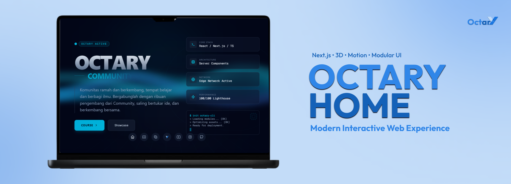
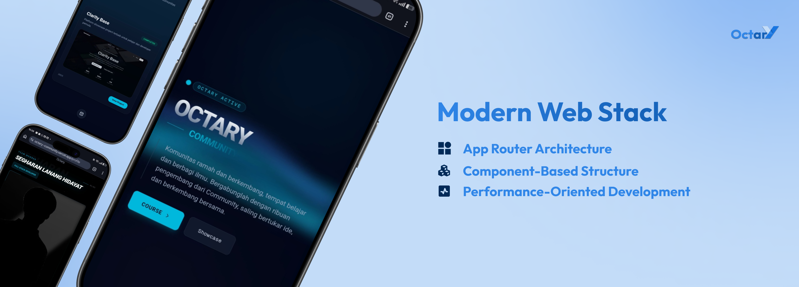

# Octary — Octary Home

<p align="center">
  
</p>

Halo! jadi ini adalah dokumentasi octary home. kalian bisa belajar dari dokumentasi ini. jadi ya ini untuk sekedar mempelajari dan memahami bagaimana octary home berfungsi. gunakan sebaik"nya untuk belajar lebih lanjut tentang nextjs dan logika cuy. 

## 🚀 Teknologi

- Next.js 15 (App Router)
- React 19
- Tailwind CSS v4
- framer-motion & motion (animasi)
- react-three-fiber & drei (3D)

<p align="center">
  
</p>

## ✨ Fitur

- Halaman:
  - `/` Beranda dengan efek Wavy Background
  - `/courses` Kurs interaktif
  - `/showcase` Kartu project dengan 3D card dan modal
  - `/profile` Profil tim dengan layout interaktif
- Navigasi Floating Dock di bagian bawah layar
- Komponen UI modular dan dapat digunakan ulang

## 🗂️ Struktur Folder

```
src/
  app/
    page.tsx
    courses/page.tsx
    showcase/page.tsx
    profile/page.tsx
  components/
    contananers/
      Hero.tsx
      CoursesView.tsx
      ShowcaseView.tsx
      ProfileView.tsx
    ui/
      3d-card.tsx
      ProjectCard.tsx
      pop-up.tsx
      background-boxes.tsx
      wavy-background.tsx
      floating-dock.tsx
      Navbar.tsx
      LoadingScreen.tsx
      CourseContent.tsx
  config/
    courses.tsx
    projectlist.tsx
    team.ts
  lib/
    utils.ts
```

## 📦 Persyaratan

- Node.js 18.18+ disarankan

<p align="center">
  
</p>

## 🛠️ Instalasi & Perintah

```bash
# Instal dependensi
npm install

# Jalankan mode pengembangan (Turbopack)
npm run dev

# Build produksi
npm run build

# Jalankan server produksi
npm run start

# Linting
npm run lint
```

## 🧩 Konvensi & Arsitektur

- Halaman (di `src/app`) dibuat minimal dan hanya merender komponen.
- UI reusable disimpan di `src/components/ui`.
- Komponen halaman/section berada di `src/components/contananers`.
- Styling menggunakan Tailwind v4 dengan utilitas dan kelas responsif.
- Alias path: `@/` merujuk ke `src/`.
